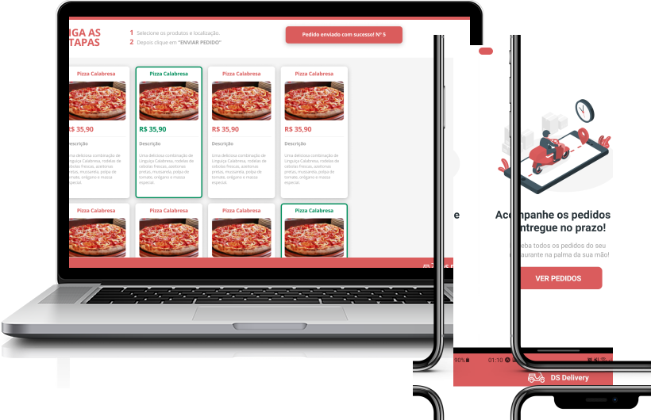

<h1 align="center">
  
</h1>

<p align="center">
 

  
</p>


<p align="center">
  
</p>

## :computer: Projeto

Aplicação Web & Mobile desenvolvida durante a Semana Dev Superior 2.0. Este projeto é baseado em uma entrega de pedidos, no qual na versão Web uma pessoa pode escolher a sua comida, definir e concluir seu pedido. Já a versão Mobile, ela é utilizada pelo entregador, o qual pode ver todos os pedidos pendentes, escolher um e iniciar a navegação (integrado com o Google Maps para definir a rota de entrega).

## :zap: Tecnologias

* [React.js](https://pt-br.reactjs.org)
* [React Native](https://reactnative.dev)
* [Expo](https://expo.dev)
* [TypeScript](https://www.typescriptlang.org)
* [Java](https://www.java.com/pt-BR/)

## :bookmark: Layout

O protótipo da versão Web e Mobile se encontra no link abaixo:

* [Protótipo - Figma](https://www.figma.com/file/vdRIG697gVQnKiWCLJNDZp/Delivery)

## :rocket: Como executar

1) Clone o repositório
  
2) Instale com o **yarn** as dependências do front-end (na pasta *front-web* ou *front-mobile*)

```shell
yarn install
```

3) Iniciar o servidor
   1) Web
   
   ```
    yarn start
   ```

   A aplicação estará sendo executada em `localhost:3000` .

   2) Mobile
   
   ```
    expo start
   ```

   **Obs:** *Para executar o app, será necessário baixar o aplicativo **Expo Go**. Após baixar, basta ler o QRCode.*
   
## :up: Deploy Implementado

O back-end está hospedado no heroku, enquanto o front-end web está hospedado no netlify. A aplicação pode ser encontrada no endereço abaixo:

* https://fellipe-delivery.netlify.app

## :reminder_ribbon: License

Este projeto está sob a licença GLP 3.0. Veja o arquivo [LICENSE](LICENSE.md) para mais detalhes.
